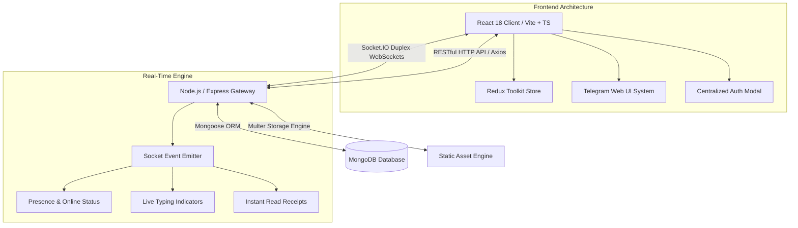

# Chat Wave — Real-Time Messaging Platform

<div align="center">


[](https://react.dev/)
[](https://www.typescriptlang.org/)
[](https://nodejs.org/)
[](https://socket.io/)
[](https://www.mongodb.com/)
[](https://mui.com/)
[](https://jwt.io/)
[](LICENSE)

**A production-grade, event-driven real-time communication platform built with a Telegram Web-inspired UI/UX, Socket.IO WebSockets, Node.js microservices, and MongoDB.**

[Explore Features](#key-features) • [Architecture](#architecture-overview) • [Getting Started](#getting-started) • [API Specification](#api-reference--endpoints)

</div>

---

## Architecture Overview

Chat Wave utilizes an event-driven, full-duplex WebSocket architecture powered by Socket.IO and Node.js backend services, backed by Redux Toolkit state management and Material UI v7 styling on the frontend.



---

## Key Features

### Real-Time Messaging & Conversations
- **Zero-Latency Event Dispatch**: Instant message delivery and real-time state synchronization across all connected clients via Socket.IO.
- **Telegram Web Aesthetic**: Custom Telegram-inspired chat canvas featuring an SVG line art doodle pattern background and embedded bubble timestamps.
- **Direct & Group Channels**: Support for 1-on-1 private messaging and multi-user group channels with admin privileges and user management.

### Enterprise Authentication & Security
- **Centralized Auth Suite**: Modal-based login, registration, and password recovery (`AuthModal.tsx`) built with glassmorphism overlays and zero page reloads.
- **JWT Protection**: Secure stateless token authentication with HTTP headers, password hashing via `bcryptjs`, and input sanitization.

### Media & File Exchange
- **Drag-and-Drop File Sharing**: Native inline preview rendering for images, videos, audio notes, PDFs, and compressed archives with direct file download capabilities.

### Real-Time Presence & Typing Indicators
- **Live Online Status**: Global presence tracking (`Online` / `Offline` status badges with soft pulse glow).
- **Typing Awareness**: Debounced typing indicators informing chat participants in real-time when users are composing messages.

---

## Technology Stack

| Domain | Technology | Purpose |
| :--- | :--- | :--- |
| **Frontend Core** | React 18, TypeScript 5, Vite | SPA architecture with strict type safety & HMR |
| **State Engine** | Redux Toolkit, React-Redux | Global state management for chats, auth, and socket state |
| **UI Design System** | Material UI (MUI v7), Vanilla CSS | Cyber Violet theme (`#7c3aed`), glassmorphism, responsive grid |
| **Real-Time Layer** | Socket.IO Client & Server | Full-duplex WebSocket communication engine |
| **Backend API** | Node.js, Express.js | Event-driven RESTful API endpoints & auth services |
| **Database** | MongoDB, Mongoose ORM | NoSQL persistence for messages, chats, and user profiles |
| **File Handling** | Multer | Server-side disk storage engine for media uploads |

---

## Project Structure

```
chat_wave/
├── client/                      # React 18 + Vite + TypeScript Frontend
│   ├── public/
│   │   └── images/              # Custom 3D background assets & vector graphics
│   └── src/
│       ├── assets/              # SVG logos & static icons
│       ├── components/
│       │   ├── auth/            # AuthModal, Login, Register, ForgotPassword
│       │   ├── chat/            # ChatDashboard, ChatList, ChatWindow, MessageBubble, MessageInput
│       │   ├── landing/         # Production SaaS LandingPage & Tech Ribbon
│       │   └── layout/          # Layout, AnimatedBackground, ChatWaveLogo
│       ├── services/            # Axios API client, Socket.IO Redux bridge, File Upload
│       ├── store/               # Redux Toolkit store & auth/chat slices
│       ├── theme/               # MUI Cyber Violet theme tokens
│       └── types.ts             # TypeScript definitions
├── server/                      # Node.js + Express + Socket.IO Backend
│   ├── controllers/             # Auth, User, Chat, Message, Upload controllers
│   ├── middleware/              # JWT auth, error handling, file upload middleware
│   ├── models/                  # User, Chat, Message Mongoose schemas
│   ├── routes/                  # API v1 routes
│   └── server.js                # Express & Socket.IO server initialization
└── Documentation/               # Production guides, test reports & deployment specs
```

---

## Getting Started

### Prerequisites

- **Node.js**: `v18.0.0` or higher
- **MongoDB**: Local MongoDB instance or MongoDB Atlas connection URI
- **npm**: `v9.0.0` or higher

### 1. Server Environment Setup

```bash
cd server
npm install

# Configure environment variables
cp .env.example .env
```

Edit `server/.env`:
```env
PORT=5000
MONGODB_URI=mongodb://localhost:27017/chatwave
JWT_SECRET=your_super_secret_jwt_key_here
CLIENT_URL=http://localhost:5173
```

Start the development backend server:
```bash
npm run dev
```

### 2. Client Environment Setup

```bash
cd client
npm install

# Configure client environment variables
cp .env.example .env
```

Edit `client/.env`:
```env
VITE_API_URL=http://localhost:5000/api/v1
VITE_SOCKET_URL=http://localhost:5000
```

Launch the Vite client server:
```bash
npm run dev
```

Navigate to `http://localhost:5173` in your browser.

---

## API Reference & Endpoints

### Authentication & User Management
| Method | Endpoint | Description |
| :--- | :--- | :--- |
| `POST` | `/api/v1/users/register` | Register a new user account |
| `POST` | `/api/v1/users/login` | Authenticate user & return JWT token |
| `POST` | `/api/v1/users/forgot-password` | Request password reset token |
| `POST` | `/api/v1/users/reset-password` | Reset password using token |
| `GET` | `/api/v1/users/users` | Fetch list of users for conversation discovery |
| `PUT` | `/api/v1/users/profile` | Update user profile information |

### Chats & Group Channels
| Method | Endpoint | Description |
| :--- | :--- | :--- |
| `GET` | `/api/v1/chats` | Fetch all chats for authenticated user |
| `POST` | `/api/v1/chats` | Create or retrieve direct conversation |
| `POST` | `/api/v1/chats/group` | Create a multi-user group chat |
| `PUT` | `/api/v1/chats/group/add-user` | Add user to group chat |
| `PUT` | `/api/v1/chats/group/remove-user` | Remove user from group chat |

### Messaging & Media Upload
| Method | Endpoint | Description |
| :--- | :--- | :--- |
| `GET` | `/api/v1/messages/:chatId` | Fetch message history for chat |
| `POST` | `/api/v1/messages` | Send message (text/file attachment) |
| `POST` | `/api/v1/upload/upload` | Upload image/document attachment |

---

## Socket.IO Event Matrix

| Event Name | Direction | Payload | Purpose |
| :--- | :--- | :--- | :--- |
| `user_online` | Client ➔ Server | `{ userId }` | Broadcast user online status |
| `join_chat` | Client ➔ Server | `chatId` | Join room channel |
| `new_message` | Client ⇄ Server | `MessageObject` | Transmit real-time message |
| `typing` | Client ➔ Server | `{ chatId, userId }` | Emit typing indicator |
| `stop_typing` | Client ➔ Server | `{ chatId, userId }` | Stop typing indicator |

---

## License

Distributed under the **ISC License**. See `LICENSE` for more information.

<div align="center">

**Built using React 18, TypeScript, Socket.IO, and Material UI**

</div>
